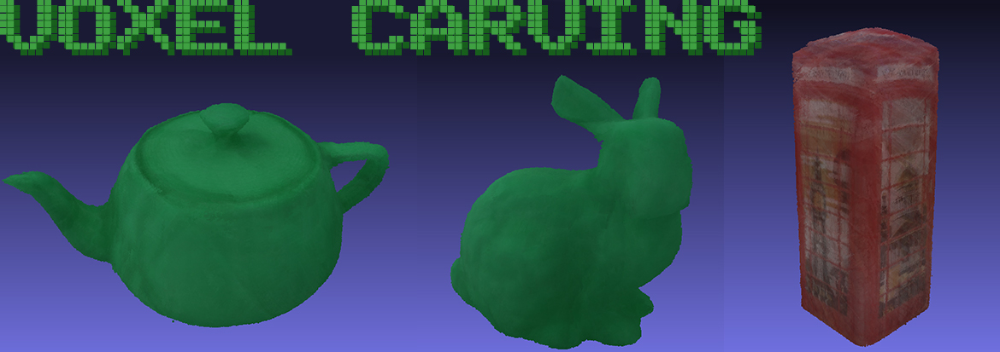

# Voxel Carving Using ArUco Markers

This is the source code of the Project Team 5 at 3D Scanning & Motion Capture course in 2022 summer semester.
In this project, we aim to reconstruct 3D objects from multiple images of the objects on top of ArUco board using voxel carving techniques.
This repository presents our code and how to build it to make a demo using our resources.



## Folder Structure

- Our repository `voxel-carving` contains `src` where the code exists and `inc` where the related headers are. 

- In `test`, we have a gtest written for testing the basic functionalities. 

- In `calib_images`, there exists a pattern and some images taken with our camera to learn our camera calibration parameters. 

- In `3d_printing`, we have our 3D printing objects, render images from Meshlab and images of the actual objects (later we have changed some objects printed in green to achieve a good result for color thresholding).

- You have to download `resources` folder from [HERE](https://1drv.ms/u/s!AgHAFcbMEq4ZhRDs0Cm9vji90jao?e=KQhO5u). Which contains our actual images to carve the voxel grid.

- At last, you have to create a folder named `Build` to compile the application.

## Running the Code

```
$ git clone https://github.com/morbi25/voxel-carving.git
$ cd voxel-carving
$ mkdir Build
$ cd Build
$ cmake ..
$ make
$ ./voxel-carving
```

## How to Run the Test
Assuming that you are still in the `Build` folder, you can run the test by running the following command:

```
$ ./test_voxel_carving
```

## Authors

- Nils Morbitzer
- Ozan Karaali
- Alexander Mitscherlich
- Baran Ekin Özdemir

## External Libraries

- `OpenCV`: OpenCV library for image processing.
- `OpenMP`: Parallelization support for our project.
- `Eigen3`: Eigen library for linear algebra.
- `gtest`: Google Test library for testing the code. IT WILL BE DOWNLOADED AUTOMATICALLY WHEN COMPILING.
- `Open3D`: Open3D library for 3D visualization. IT WILL BE DOWNLOADED AUTOMATICALLY WHEN COMPILING. We still recommend to use Meshlab externally for visualization with using VoxelGrid::toPLY().
